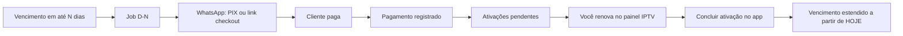

# Pagamento, automação D-N e Ativações pendentes

Documento de produto e execução para o fluxo operacional do revendedor IPTV.

Relacionado: [03-integrations-pix-whatsapp.md](./03-integrations-pix-whatsapp.md) · [10-billing-dual-layer.md](./10-billing-dual-layer.md)

---

## Fluxo desejado (fechado)



| Etapa | Quem | O que acontece |
|-------|------|----------------|
| **1. Monitorar vencimento** | Job (Fase 4) | Clientes com `expiresAt` entre hoje e **hoje + N dias** (`daysBeforeDue`, default **3**) |
| **2. Cobrar** | Automação + WhatsApp | Gera cobrança (PIX copia e cola ou link InfinitePay) e envia mensagem |
| **3. Pagar** | Cliente | PSP (webhook) **ou** você registra manualmente (dinheiro, antecipado, transferência) |
| **4. Confirmar pagamento** | `PaymentConfirmationService` | Cria `Payment`, fatura `paid`, **N ativações pendentes** (1 por conexão) |
| **5. Operar servidor** | Você | Renova MAC/app no painel externo |
| **6. Concluir ativação** | UI `/activations` | Marca tarefa `completed`; quando **todas** do mesmo pagamento concluídas → `expiresAt = hoje + ciclo do plano` |

**Importante:** o vencimento (`expiresAt`) **não** muda no passo 4 — só no passo 6, usando a **data atual** como base.

---

## Providers (roadmap)

| Provider | Entrega |
|----------|---------|
| Asaas | PIX copia e cola |
| Mercado Pago | PIX copia e cola |
| PushinPay | PIX copia e cola |
| InfinitePay | Link checkout (WhatsApp) |

**Config tenant:** um provider escolhido para todas as cobranças (remover roteamento por valor — backlog).

---

## Pagamento manual

| Cenário | Comportamento |
|---------|----------------|
| Dinheiro após cobrança PSP gerada | Você confirma na fatura; PSP **não** baixa automaticamente |
| Antecipado | Fatura manual ou confirmação manual; ativações + fila operacional |
| Pagamento parcial | **Não suportado** — valor integral |

Endpoint atual: `POST /invoices/:id/mark-paid` → delega a `PaymentConfirmationService`.

---

## Modelo de dados

### `tenant_billing_automation_config`

| Campo | Default | Uso |
|-------|---------|-----|
| `daysBeforeDue` | `3` | Janela D-N antes de `expiresAt` |
| `sendWhatsapp` | `true` | Enviar cobrança no Zap (Fase 4) |
| `sendPaymentCharge` | `true` | Gerar PIX/link antes do envio |
| `active` | `true` | Liga/desliga automação |

### `connection_renewal_tasks` (UI: **Ativações pendentes**)

| Campo | Uso |
|-------|-----|
| `tenantId`, `customerId`, `connectionId` | Escopo e MAC a renovar |
| `paymentId`, `invoiceId` | Origem financeira |
| `status` | `pending` \| `completed` \| `cancelled` |
| `paidAt` | Quando o cliente pagou |
| `completedAt` | Quando você deu OK no app |

### Regra de `expiresAt`

Quando a **última** tarefa `pending` de um `paymentId` vira `completed`:

```
expiresAt = extendExpiryFromDate(hoje, customer.plan.billingCycle)
```

- `monthly` → +1 mês  
- `quarterly` → +3 meses  
- `yearly` → +1 ano  

Implementação: `activation-expiry.util.ts` + `ActivationsService.complete()`.

---

## API (tenant)

| Método | Rota | Descrição |
|--------|------|-----------|
| GET | `/api/activations` | Lista (filtro `status`, busca) |
| GET | `/api/activations/pending-count` | KPI dashboard |
| POST | `/api/activations/:id/complete` | Concluir ativação no servidor |

---

## Seeds de exemplo

```bash
npm run seed:activations -w apps/api
```

Cria por conta (clientes com conexões):

1. **Pendentes** — vence em 2 dias (simula D-3)  
2. **Parcial** — uma conexão já concluída, outras pendentes  
3. **Concluídas** — vencimento já estendido  
4. **Extra** — vence em 3 dias, todas pendentes  

Também upserta `tenant_billing_automation_config` com `daysBeforeDue = 3`.

---

## UI

| Rota | Tela |
|------|------|
| `/activations` | **Ativações pendentes** — lista, botão **Concluir**, link WhatsApp |

Nav tenant: item entre Pagamentos e Configurações.

---

## Escopo SaaS (plataforma)

Pagamento de fatura `scope=platform` **não** cria `connection_renewal_tasks` — apenas mantém tenant ativo.

---

## Próximas entregas (ordem)

1. ✅ Tabela + API + seeds + UI ativações  
2. Remover roteamento PSP por valor; provider único  
3. Adapters reais (4 PSPs) + webhooks → `PaymentConfirmationService`  
4. Job D-N + WhatsApp (`daysBeforeDue` configurável)  
5. Modal “Registrar pagamento” com método (cash, transfer, …) na fatura  

---

## Prompt Cursor (Fase 4 automação)

> Implemente job D-N conforme doc 11: ler `tenant_billing_automation_config.daysBeforeDue`, clientes com `expiresAt` na janela, gerar cobrança com provider fixo do tenant, enviar WhatsApp com `payment_block`. Não alterar `expiresAt` até conclusão em `/activations`.
