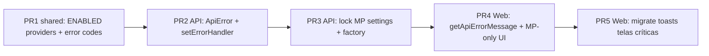

# Feature 13 — Mercado Pago único + erros mapeados (API → UI)

**Status:** 📋 Próxima etapa de implementação  
**Prioridade:** Alta (operação + suporte)  
**Última revisão:** 11/06/2026  

Relacionado: [03-integrations-pix-whatsapp.md](./03-integrations-pix-whatsapp.md) · [10-billing-dual-layer.md](./10-billing-dual-layer.md) · [IMPLEMENTATION_STATUS.md](./IMPLEMENTATION_STATUS.md)

---

## Objetivo

1. **Travar o sistema em Mercado Pago (MP)** como único PSP ativo — Asaas, Efi e futuros (PushinPay, InfinitePay) ficam **desabilitados** na UI e bloqueados na API até nova decisão de produto.
2. **Padronizar erros** para que toasts, formulários e logs mostrem o **motivo real** retornado pela API (mensagem + código), em vez de genéricos como *"Erro ao gerar PIX"* ou *"Falha ao conectar"*.

---

## Contexto / problema atual

### PSPs

| Onde | Hoje |
|------|------|
| `PAYMENT_PROVIDER_VALUES` | `asaas`, `efi`, `mercadopago` |
| UI tenant (`PaymentCredentialsSection`) | Combobox com os 3 providers |
| UI admin (`AdminSettingsPage`) | Default `asaas` |
| `PaymentProviderFactory` | Asaas + MP implementados; Efi lança *"ainda não implementado"* |
| Webhook | MP implementado; Asaas pendente |

**Decisão de produto:** trabalhar **somente com Mercado Pago** por enquanto. Demais providers não têm previsão e não são prioridade.

### Erros

| Camada | Comportamento atual | Problema |
|--------|---------------------|----------|
| API billing | `InvoiceActionError` → `{ message }` em algumas rotas | Outras rotas retornam `400` genérico ou `throw` sem handler |
| API PSP | `PaymentProviderError` com mensagem do adapter | Nem sempre chega formatado ao client |
| API WhatsApp | `{ message, code }` em Evolution/Meta | Inconsistente com billing |
| Web | `err.response?.data?.message ?? 'Erro ao…'` espalhado | Mensagem real perdida se body diferente ou `Error` sem `response` |
| React Query | `error.message` em vários `onError` | Axios coloca mensagem de rede, não do backend |

**Sintoma:** usuário vê tooltip/toast vago; suporte não sabe se foi credencial MP, WhatsApp desconectado, fatura paga, slug inválido, etc.

---

## Escopo

### Dentro

- Flag/catálogo de providers **habilitados** (somente `mercadopago`).
- UI: esconder ou desabilitar outros PSPs; texto explicativo *"Outros meios de pagamento em breve"*.
- API: rejeitar persistência de provider ≠ MP (tenant + plataforma).
- Factory/router: resolver sempre MP; tentativa explícita de outro provider → erro mapeado `PAYMENT_PROVIDER_DISABLED`.
- Contrato único de erro HTTP JSON.
- Helper front `getApiErrorMessage(error)` + adoção nas telas críticas (settings, faturas, automação, WhatsApp).
- Testes unitários do parser de erro e da validação de provider.

### Fora (esta feature)

- Implementar Asaas / Efi / InfinitePay / PushinPay.
- Migrar credenciais Asaas existentes em produção (apenas aviso na UI se detectar provider legado).
- i18n completo EN/ES.
- Sentry / observabilidade externa (pode ser follow-up).

---

## Parte A — Mercado Pago como único PSP

### A.1 Shared (`packages/shared`)

```typescript
/** PSPs available in product UI and API (expand when product enables more). */
export const ENABLED_PAYMENT_PROVIDER_VALUES = ['mercadopago'] as const;

export type EnabledPaymentProviderValue = (typeof ENABLED_PAYMENT_PROVIDER_VALUES)[number];

export function isEnabledPaymentProvider(value: string): value is EnabledPaymentProviderValue {
  return (ENABLED_PAYMENT_PROVIDER_VALUES as readonly string[]).includes(value);
}
```

- Manter `PAYMENT_PROVIDER_VALUES` / labels para **exibição histórica** em faturas antigas (`invoice.paymentProvider`).
- `PAYMENT_PROVIDER_FEE_HINTS`: só entrada `mercadopago` na UI ativa.

### A.2 UI

| Tela | Mudança |
|------|---------|
| `PaymentCredentialsSection` (tenant) | Remover combobox multi-PSP ou exibir só MP (read-only) + link doc credencial MP |
| `AdminSettingsPage` | Default e único provider: `mercadopago` |
| `PaymentProviderFields` (admin legado) | Alinhar ao mesmo catálogo |
| Badge em `InvoiceDetailPage` | Sem mudança (label histórico OK) |

**Copy sugerida (tenant):**

> Meio de pagamento: **Mercado Pago (PIX)**  
> Outros provedores serão habilitados em versões futuras.

### A.3 API

| Endpoint / serviço | Regra |
|--------------------|--------|
| Salvar credenciais tenant | Aceitar só `provider: 'mercadopago'` |
| `platformPaymentConfig` | Forçar / validar `mercadopago` |
| `PaymentRouterService` | Retornar sempre `mercadopago` para tenant ativo |
| `PaymentProviderFactory.getProvider` | `asaas` / `efi` → `PaymentProviderError` com code `PAYMENT_PROVIDER_DISABLED` |
| Webhook routes | Manter só `.../mercadopago`; documentar Asaas como desativado |

**Contas com provider legado no banco:** na leitura de settings, se `active` provider ≠ MP, retornar flag `legacyProviderWarning: true` para banner na UI (não migrar automaticamente).

### A.4 Critérios de aceite (PSP)

- [ ] Não é possível selecionar Asaas/Efi em Configurações (tenant e admin).
- [ ] API retorna `400` com code `PAYMENT_PROVIDER_DISABLED` se payload trouxer outro provider.
- [ ] Gerar PIX e webhook continuam funcionando com credencial MP.
- [ ] Faturas antigas com `paymentProvider: 'asaas'` ainda exibem badge legível.

---

## Parte B — Mapeamento de erros (API → UI)

### B.1 Contrato HTTP padrão

Todas as respostas de erro da API (4xx/5xx) devem preferir:

```json
{
  "message": "Texto legível em português para o usuário",
  "code": "MACHINE_READABLE_CODE",
  "details": {}
}
```

| Campo | Obrigatório | Uso |
|-------|-------------|-----|
| `message` | Sim | Toast, inline, suporte |
| `code` | Recomendado | Telemetria, i18n futura, docs |
| `details` | Não | Campos de formulário, provider, invoiceId |

**Exemplos de `code` (catálogo inicial):**

| code | HTTP | Origem típica |
|------|------|----------------|
| `VALIDATION_ERROR` | 400 | Zod / body inválido |
| `NOT_FOUND` | 404 | Fatura, cliente, conta |
| `NOT_ALLOWED` | 400 | Fatura paga, cancelada |
| `CONFLICT` | 409 | Duplicidade, estado inválido |
| `PAYMENT_PROVIDER_DISABLED` | 400 | PSP não habilitado |
| `PAYMENT_CREDENTIALS_MISSING` | 400 | MP sem token |
| `PAYMENT_PROVIDER_ERROR` | 502 | Resposta MP rejeitada |
| `WHATSAPP_NOT_CONFIGURED` | 503 | Evolution env / config |
| `WHATSAPP_NOT_CONNECTED` | 409 | Sessão desconectada |
| `WHATSAPP_PROVIDER_ERROR` | 502 | Evolution API 4xx/5xx |
| `INTERNAL_ERROR` | 500 | Fallback (sem vazar stack) |

### B.2 API — implementação

1. **`ApiError` helper** (ex.: `apps/api/src/core/errors/api-error.ts`):
   - `toReply(reply, error)` centraliza status + body.
2. **Fastify `setErrorHandler`** global:
   - `ZodError` → `VALIDATION_ERROR` + primeira mensagem
   - `InvoiceActionError` → mapear `code` existente
   - `PaymentProviderError` → `PAYMENT_PROVIDER_ERROR` ou `PAYMENT_CREDENTIALS_MISSING`
   - `EvolutionWhatsAppError` → códigos já usados (`NOT_CONFIGURED`, etc.)
   - `Prisma P2002` → `CONFLICT` com mensagem amigável
   - Desconhecido → log server + `INTERNAL_ERROR`
3. **Refatorar rotas críticas** para usar handler ou `ApiError` (billing, settings, webhooks, WhatsApp, admin tenants).
4. **Logs:** `requestId` + `code` + mensagem (sem secrets).

### B.3 Web — implementação

1. **`getApiErrorMessage(error: unknown, fallback?: string): string`** em `apps/web/src/shared/api/api-error.ts`:
   - Axios: `response.data.message` → `response.data.error` → `code` conhecido → fallback
   - `Error` nativo: `.message` se não for *"Network Error"*
2. **`getApiErrorCode(error: unknown): string | undefined`**
3. Substituir padrões repetidos:

```typescript
// Antes
showToast.error(err.response?.data?.message ?? 'Erro ao gerar PIX');

// Depois
showToast.error(getApiErrorMessage(err, 'Erro ao gerar PIX'));
```

4. **Prioridade de adoção (telas):**
   - Configurações (PIX, automação, WhatsApp)
   - Faturas (lista, detalhe, criar, gerar PIX, send-charge)
   - Admin contas
   - Login (manter mensagem de credenciais)

5. **Opcional nesta entrega:** componente `MutationErrorToast` que já encapsula `getApiErrorMessage`.

### B.4 Critérios de aceite (erros)

- [ ] Gerar PIX sem credencial MP → toast com mensagem da API (*"Credencial do PSP…"*), não só *"Erro ao gerar PIX"*.
- [ ] WhatsApp desconectado ao enviar cobrança → toast *"WhatsApp não conectado…"* (code `WHATSAPP_NOT_CONNECTED`).
- [ ] Payload inválido no admin (slug com espaço) → mensagem Zod no toast ou no campo.
- [ ] Erro 500 → *"Erro interno. Tente novamente."* sem stack trace.
- [ ] Pelo menos 1 teste unitário API (mapper) + 1 teste web (`getApiErrorMessage`).

---

## Plano de implementação (PRs sugeridos)



| PR | Entrega | Estimativa |
|----|---------|------------|
| **PR1** | `ENABLED_PAYMENT_PROVIDER_VALUES`, `API_ERROR_CODES`, `getApiErrorMessage` (shared ou web) | 0,5 d |
| **PR2** | `ApiError` + `setErrorHandler` no Fastify | 1 d |
| **PR3** | Validação MP-only em settings; router/factory; banner legacy | 0,5 d |
| **PR4** | UI tenant/admin só MP; defaults `mercadopago` | 0,5 d |
| **PR5** | Trocar toasts nas telas críticas + testes | 1 d |

**Total orientativo:** ~3,5 dias de dev.

---

## Riscos

| Risco | Mitigação |
|-------|-----------|
| Tenant com credencial Asaas ativa em prod | Banner `legacyProviderWarning`; não apagar dados |
| Mensagens MP em inglês no adapter | Mapear no `MercadoPagoPaymentProvider` para PT quando possível |
| Regressão em rotas sem handler | Checklist manual + smoke no RELEASE_CHECKLIST |
| Toast duplicado (interceptor + onError) | Não auto-toast no interceptor; só helper |

---

## Smoke test pós-deploy

1. Configurações → só Mercado Pago visível; salvar access token MP.
2. Criar fatura → gerar PIX → mensagem clara se token inválido.
3. Enviar cobrança WhatsApp sem conectar → mensagem de desconectado.
4. Admin → criar conta com identificador inválido → mensagem de validação.
5. Webhook MP pagamento → continua 200; evento `order` ignorado ou 401 documentado.

---

## Atualização de documentação

Após implementar:

- [ ] `IMPLEMENTATION_STATUS.md` — Fase 3.1 e Asaas webhook marcados como *congelados*.
- [ ] `03-integrations-pix-whatsapp.md` — nota *"MVP: apenas Mercado Pago"*.
- [ ] `RELEASE_CHECKLIST.md` — item smoke de erro legível + MP-only.

---

## Referência rápida — arquivos tocados

| Área | Arquivos principais |
|------|---------------------|
| Shared | `billing-enums.ts`, `payment-routing.ts`, novo `api-error-codes.ts` |
| API | `main.ts`, `payment-provider.factory.ts`, `tenant-settings`*, `platform-settings`*, `invoice-route.util.ts` |
| Web | `PaymentCredentialsSection.tsx`, `AdminSettingsPage.tsx`, `api-error.ts`, páginas em `features/billing/`, `features/settings/` |

\* Rotas/serviços de persistência de credenciais e routing.
