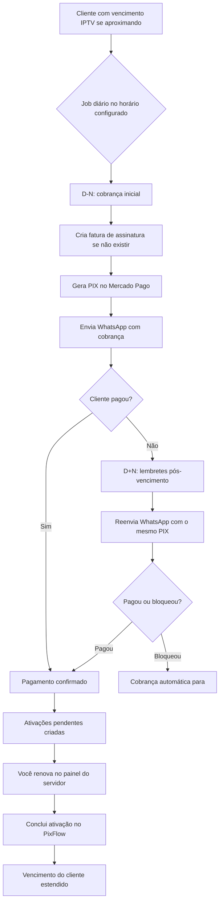

# Roteiro — Vídeo tutorial PixFlow (visão tenant / revendedor)

Roteiro para gravação de vídeo apresentando o aplicativo **PixFlow** na visão do revendedor (tenant).

**Duração estimada:** 16 a 19 minutos (versão completa).

**Formato:** cada bloco contém marcação de tempo, ações na tela (`[AÇÃO]`) e texto de narração (`[NARRAÇÃO]`). O texto de narração pode ser usado diretamente em serviços de TTS (Google Cloud Text-to-Speech, ElevenLabs, etc.).

**Escopo:** somente visão tenant — não inclui painel `super_admin`.

---

## Índice

1. [Abertura e login](#bloco-1--abertura-e-login-0000--0100)
2. [Menu e dashboard](#bloco-2--menu-e-dashboard-0100--0330)
3. [Planos e servidores](#bloco-3--planos-e-servidores-catálogo-0330--0530)
4. [Clientes e conexões](#bloco-4--clientes-e-conexões-0530--0800)
5. [Faturas e pagamentos](#bloco-5--faturas-e-pagamentos-0800--1030)
6. [Ativações pendentes](#bloco-6--ativações-pendentes-1030--1130)
7. [Automação de cobrança (detalhado)](#bloco-7--automação-de-cobrança-1130--1600)
8. [Logs e perfil](#bloco-8--logs-e-perfil-1600--1700)
9. [Encerramento](#bloco-9--encerramento-1700--1800)
10. [Taxa Mercado Pago (PIX)](#taxa-mercado-pago-pix)
11. [Versão só narração (TTS completo)](#versão-só-narração-tts-completo)
12. [Versão só narração — automação](#versão-só-narração--automação)
13. [Dicas para gravar](#dicas-para-gravar)

---

## Bloco 1 — Abertura e login `[00:00 – 01:00]`

**[AÇÃO]** Tela de login (`/login`). Mostrar logo PixFlow e campos de e-mail/senha.

**[NARRAÇÃO]**

> Olá! Neste vídeo vou apresentar o PixFlow, o sistema para revendedores gerenciarem clientes, cobranças e renovações em um só lugar.
>
> O PixFlow funciona no computador e no celular. Você pode instalar como aplicativo, direto pelo navegador.
>
> Para começar, acesse a tela de login e entre com o e-mail e a senha da sua conta de revendedor.

**[AÇÃO]** Fazer login e entrar no dashboard.

**[NARRAÇÃO]**

> Após o login, você cai direto no painel principal. Todas as informações da sua operação ficam isoladas na sua conta — seus dados não se misturam com os de outros revendedores.

---

## Bloco 2 — Menu e dashboard `[01:00 – 03:30]`

**[AÇÃO]** Abrir o menu lateral (desktop) ou hambúrguer (mobile). Passar pelos itens: Dashboard, Clientes, Planos, Servidores, Faturas, Pagamentos, Ativações pendentes, Registro de atividades, Configurações e Perfil.

**[NARRAÇÃO]**

> No menu lateral você encontra tudo que precisa no dia a dia.
>
> Dashboard é a visão geral. Clientes, Planos e Servidores formam a base da operação. Faturas e Pagamentos controlam a cobrança. Ativações pendentes mostra o que falta renovar no servidor depois que o cliente paga. Em Configurações você conecta Mercado Pago, WhatsApp e automações.

**[AÇÃO]** Voltar ao Dashboard. Rolar pelas seções: Cobrança e pagamentos, Clientes e vencimentos, Infraestrutura e receita.

**[NARRAÇÃO]**

> O dashboard resume sua operação em tempo real.
>
> Na parte de cobrança, você vê quanto recebeu no mês, quantas faturas estão em aberto ou vencidas e a taxa de cobrança do ciclo atual.
>
> Em clientes, acompanhe o total cadastrado, quantos estão ativos, quem vence nos próximos sete dias e quem já está vencido.
>
> Mais abaixo aparecem ativações pendentes, próximos vencimentos e pagamentos recentes. Clicando em qualquer card, você vai direto para a lista filtrada.

**[AÇÃO]** Clicar em um card (ex.: "Vencendo em 7 dias") e mostrar que abre a lista de clientes já filtrada.

**[NARRAÇÃO]**

> Os cards são atalhos. Um clique e você já está na tela certa, com o filtro aplicado.

---

## Bloco 3 — Planos e servidores (catálogo) `[03:30 – 05:30]`

**[AÇÃO]** Ir em **Planos** (`/plans`). Mostrar lista, busca e filtros.

**[NARRAÇÃO]**

> Antes de cadastrar clientes, configure seu catálogo. Comece pelos planos.
>
> Cada plano tem nome, valor, limite de conexões e status. Planos inativos não aparecem para novos cadastros, mas os clientes existentes continuam vinculados.

**[AÇÃO]** Clicar em **Novo plano** (ou editar um existente). Mostrar campos do formulário e salvar.

**[NARRAÇÃO]**

> Para criar um plano, informe o nome, o preço, quantas conexões o cliente pode ter e, se quiser, tags para organização. Salve e o plano já fica disponível.

**[AÇÃO]** Ir em **Servidores** (`/servers`). Mostrar lista e criar/editar um servidor.

**[NARRAÇÃO]**

> Agora os servidores. Cada servidor representa o painel onde você ativa as conexões dos clientes.
>
> Cadastre o nome e a URL do painel. Quando um cliente tiver uma conexão, você associa ela ao servidor correto — isso facilita na hora da renovação.

---

## Bloco 4 — Clientes e conexões `[05:30 – 08:00]`

**[AÇÃO]** Ir em **Clientes** (`/customers`). Mostrar busca por nome/telefone, filtros e paginação.

**[NARRAÇÃO]**

> A tela de clientes é o coração do sistema. Aqui você gerencia toda a base de assinantes.
>
> Use a busca para encontrar por nome ou telefone. Os filtros permitem ver só ativos, vencidos, por plano ou por status.

**[AÇÃO]** Abrir formulário de **Novo cliente**. Preencher nome, telefone, plano, vencimento. Mostrar seção de conexões (MAC, servidor, app).

**[NARRAÇÃO]**

> Para cadastrar um cliente, clique em Novo cliente.
>
> Preencha os dados básicos: nome, telefone no formato internacional, plano e data de vencimento.
>
> Em conexões, adicione o MAC do aparelho, escolha o servidor e o aplicativo. Um cliente pode ter mais de uma conexão, respeitando o limite do plano.

**[AÇÃO]** Salvar. Mostrar linha na lista com badge de status. Clicar para editar. Mostrar ações de ativar/desativar.

**[NARRAÇÃO]**

> O status do cliente muda conforme o vencimento: ativo, vencendo ou vencido. Você pode desativar um cliente sem apagar o histórico, e reativar quando necessário.

---

## Bloco 5 — Faturas e pagamentos `[08:00 – 11:00]`

**[AÇÃO]** Ir em **Faturas** (`/invoices`). Mostrar lista, filtros por status (aberta, paga, vencida).

**[NARRAÇÃO]**

> Na área de faturas você controla o que cada cliente deve pagar.
>
> As faturas podem ser de assinatura — o ciclo mensal — ou avulsas, para cobranças pontuais. O status mostra se está em aberto, paga ou vencida.

**[AÇÃO]** Criar uma fatura (se possível no ambiente de demo) ou abrir detalhe de uma fatura existente. Mostrar PIX/código de pagamento.

**[NARRAÇÃO]**

> Ao abrir uma fatura, você vê o valor, o vencimento e o código PIX para pagamento. Se o Mercado Pago estiver configurado, o QR Code e o link são gerados automaticamente.

### 5.1 — Taxa do Mercado Pago no PIX `[09:30 – 10:30]`

**[AÇÃO]** Ir em **Configurações → Pagamentos** (`/settings?tab=pagamentos`). Mostrar que o meio de pagamento é Mercado Pago e o hint de taxa percentual na UI.

**[NARRAÇÃO]**

> Uma dúvida comum: quanto custa receber por PIX?
>
> O PixFlow **não cobra taxa sobre o pagamento do seu cliente**. Quem desconta a tarifa é o **Mercado Pago**, direto na **sua conta** de revendedor — a mesma conta cujo access token você cadastrou aqui em Configurações.
>
> O modelo do Mercado Pago para recebimento via PIX integrado — QR Code, link ou checkout — é **percentual sobre o valor pago**, não taxa fixa por cobrança.
>
> Segundo a tabela pública do Mercado Pago Brasil — consultada em **junho de 2026** — as faixas mais comuns para PIX são:
>
> **0,99%** do valor, quando o dinheiro fica disponível em cerca de **30 dias**.
> **1,99%** do valor, quando você recebe **na hora**.
>
> Exemplos práticos para uma mensalidade de **R$ 35,00**:
>
> Com **0,99%**, a taxa fica em torno de **R$ 0,35** — você recebe líquido cerca de **R$ 34,65**.
> Com **1,99%**, a taxa fica em torno de **R$ 0,70** — você recebe líquido cerca de **R$ 34,30**.
>
> Para **R$ 50,00**: **R$ 0,50** ou **R$ 1,00** de taxa, conforme o prazo escolhido na sua conta MP.
>
> Esses valores são **referência** — podem variar conforme o tipo de conta, promoções vigentes e prazo de liberação que você tiver no Mercado Pago. Sempre confira a página oficial de taxas antes de precificar seus planos.
>
> Link oficial: [mercadopago.com.br/costs-section](https://www.mercadopago.com.br/costs-section)

**[AÇÃO]** Voltar a uma fatura com PIX gerado. Opcional: mostrar extrato do Mercado Pago (fora do app) com o desconto da taxa.

**[NARRAÇÃO]**

> Na prática: cada PIX que seu cliente paga entra no Mercado Pago já com o desconto da tarifa. O PixFlow só registra o valor integral da fatura e confirma o pagamento — o líquido que cai na sua conta MP é o valor menos a taxa do provedor.

**[AÇÃO]** Ir em **Pagamentos** (`/payments`). Mostrar lista de pagamentos confirmados.

**[NARRAÇÃO]**

> Quando o cliente paga, o pagamento aparece na tela de Pagamentos com data, valor e fatura vinculada.
>
> O sistema também pode criar uma ativação pendente automaticamente — é o próximo passo depois do pagamento.

---

## Bloco 6 — Ativações pendentes `[11:00 – 12:00]`

**[AÇÃO]** Ir em **Ativações pendentes** (`/activations`). Mostrar lista filtrada por pendentes.

**[NARRAÇÃO]**

> Depois que o pagamento é confirmado, o PixFlow coloca a renovação na fila de ativações pendentes.
>
> Essa tela é a sua lista de tarefas: o que você precisa fazer manualmente no servidor — renovar o MAC, estender o prazo no painel.

**[AÇÃO]** Abrir detalhe de uma ativação. Mostrar botão de concluir e atualização de vencimento.

**[NARRAÇÃO]**

> Abra a ativação para ver cliente, conexão, servidor e valor pago. Quando terminar no painel do servidor, marque como concluída.
>
> O sistema atualiza o vencimento do cliente automaticamente, conforme a regra do plano.

---

## Bloco 7 — Automação de cobrança `[12:00 – 16:30]`

> **Nota de gravação:** este bloco vale ~4 minutos. Grave em duas partes: (1) Configurações → Automação e (2) resultado no Dashboard / Faturas / Ativações.

### 7.1 — Visão geral do ciclo `[11:30 – 12:30]`

**[AÇÃO]** Ir em **Configurações → Automação** (`/settings?tab=automacao`).

**[NARRAÇÃO]**

> Agora vou explicar o coração do PixFlow: a automação de cobrança.
>
> O sistema funciona em **ciclos automáticos**, sem você precisar lembrar de cobrar cliente por cliente.
>
> Todo dia, no horário que você configurar, um **job interno** roda no servidor. Ele olha sua base de clientes, identifica quem está perto de vencer, gera fatura, cria o PIX e manda a cobrança no WhatsApp — tudo sozinho.
>
> Depois que o cliente paga, o PixFlow registra o pagamento, coloca a renovação na fila de **Ativações pendentes** e, quando você concluir no servidor, atualiza o vencimento do cliente.
>
> São **três momentos** principais:
>
> **Um** — cobrança **antes** do vencimento, chamada de **D menos N**.
> **Dois** — lembretes **depois** do vencimento, chamados de **D mais N**.
> **Três** — confirmação de pagamento e fila de ativação no servidor.

**[AÇÃO]** Mostrar o diagrama abaixo (slide, figura ou desenho na tela):



**[NARRAÇÃO]**

> Repare: a automação cobre a **parte financeira e a comunicação**. A renovação no painel IPTV ainda é manual — mas o PixFlow te avisa exatamente o que fazer depois de cada pagamento.

---

### 7.2 — Cobrança inicial: D menos N `[12:30 – 13:45]`

**[AÇÃO]** Na aba Automação, apontar os campos: **Automação ativa**, **Dias antes do vencimento**, **Horário diário**, **Gerar PIX antes do envio**, **Enviar cobrança via WhatsApp**.

**[NARRAÇÃO]**

> A cobrança inicial acontece **antes** do vencimento do cliente — daí o nome **D menos N**.
>
> **D** é o dia do vencimento. **N** é quantos dias antes você quer cobrar. O padrão é **três dias**: se o cliente vence dia 15, a partir do dia 12 ele entra na janela de cobrança.
>
> No **horário diário**, você define quando o job roda — por exemplo, **9 horas e zero minutos**, no fuso de **São Paulo**. Em produção, o sistema só processa sua conta quando bate exatamente esse horário.
>
> Quando o job roda, ele faz o seguinte para cada cliente **ativo** dentro da janela:
>
> **Primeiro**, verifica se já existe uma fatura de **assinatura** para o ciclo atual — o mês de referência. Se não existir, **cria automaticamente**.
>
> **Segundo**, se a opção **Gerar PIX antes do envio** estiver ligada, o PixFlow chama o Mercado Pago e gera o código PIX da fatura.
>
> **Terceiro**, se **Enviar cobrança via WhatsApp** estiver ligada, manda a mensagem para o telefone do cliente com valor, vencimento e o PIX. Cada fatura recebe **no máximo uma cobrança automática bem-sucedida** — o sistema não fica spammando todo dia.
>
> Clientes **bloqueados** ou **inativos** ficam de fora. Faturas **avulsas** também não entram nessa automação — só assinaturas recorrentes.

**[AÇÃO]** Ir em **Configurações → Cobrança → Cobrança inicial (D-N)**. Mostrar templates de mensagem com variáveis (`{{nome}}`, `{{valor}}`, `{{pix}}`, etc.).

**[NARRAÇÃO]**

> As mensagens da cobrança inicial ficam na aba **Cobrança**, sub-aba **Cobrança inicial**. Você personaliza o texto e usa variáveis como nome do cliente, valor e código PIX. O job usa exatamente esse template no envio.

**[AÇÃO]** Voltar à aba Automação. Mencionar relatório WhatsApp ao revendedor após cada execução.

**[NARRAÇÃO]**

> Depois de cada execução, se o WhatsApp estiver conectado, **você também recebe um relatório** no seu número cadastrado — com o resumo do que foi feito naquele horário. Assim você sabe quantas cobranças saíram sem precisar abrir o sistema.

---

### 7.3 — Lembretes pós-vencimento: D mais N `[13:45 – 14:45]`

**[AÇÃO]** Na aba Automação, rolar até **Pós-vencimento (D+N)**. Mostrar: **Lembretes pós-vencimento ativos**, janelas (ex.: D+1 · D+7 · D+15), **Dias de grace após falha**.

**[NARRAÇÃO]**

> Se o cliente **não pagou** na cobrança inicial, entra a segunda fase: os **lembretes pós-vencimento**, ou **D mais N**.
>
> A diferença importante: aqui o PixFlow **não cria fatura nova** e **não gera PIX de novo**. Ele **reenvia o WhatsApp** usando o **mesmo PIX** que já foi gerado na cobrança inicial.
>
> Você configura **janelas** — dias após o vencimento em que o lembrete pode sair. O padrão é **D mais 1**, **D mais 7** e **D mais 15**. Exemplo: venceu dia 10 → lembrete no dia 11, depois no 17, depois no 25.
>
> Cada janela manda **no máximo uma mensagem bem-sucedida** por fatura. Não é cobrança todo dia — são toques estratégicos.
>
> Se o WhatsApp falhar — instância desconectada, telefone inválido — o sistema **tenta de novo** dentro do período de **grace**, os dias extras que você configura. Passou o grace sem sucesso, aquela janela é encerrada e o próximo lembrete só na janela seguinte.
>
> Quando o cliente **paga**, a fatura vai para **paga** e **todos os lembretes futuros param automaticamente**.
>
> Se você **bloquear** o cliente, ele sai de **todas** as automações — tanto D menos N quanto D mais N. O bloqueio é decisão sua, manual, quando quiser interromper a cobrança.

**[AÇÃO]** Ir em **Configurações → Cobrança → Pós-vencimento (D+N)**. Mostrar templates por janela.

**[NARRAÇÃO]**

> Os textos dos lembretes ficam em **Cobrança → Pós-vencimento**. Você pode usar um tom mais amigável no D mais 1 e mais firme no D mais 15, por exemplo.

---

### 7.4 — O que acontece quando o cliente paga `[14:45 – 15:30]`

**[AÇÃO]** Ir em **Faturas**, abrir uma fatura paga (ou simular). Depois ir em **Pagamentos** e **Ativações pendentes**.

**[NARRAÇÃO]**

> Quando o pagamento é confirmado — pelo **webhook do Mercado Pago** ou por **confirmação manual** sua — o PixFlow:
>
> **Registra o pagamento** na tela de Pagamentos.
> **Marca a fatura como paga**.
> **Cria uma ativação pendente para cada conexão** do cliente — uma tarefa por MAC.
>
> Atenção a um detalhe importante: o **vencimento do cliente ainda não muda** nesse momento. Ele só é estendido **depois** que você concluir a ativação.
>
> O fluxo operacional fica assim: cliente paga → aparece em **Ativações pendentes** → você renova no painel do servidor IPTV → volta no PixFlow e clica em **Concluir** → o sistema atualiza o vencimento a partir de **hoje**, somando o ciclo do plano.

**[AÇÃO]** Mostrar conclusão de uma ativação e mensagem de vencimento atualizado.

**[NARRAÇÃO]**

> Isso garante que o vencimento só avance quando o serviço foi realmente renovado no servidor — e não só quando o dinheiro entrou.

---

### 7.5 — Opções avançadas e pré-requisitos `[15:30 – 16:00]`

**[AÇÃO]** Voltar à aba Automação. Mostrar **Cancelar faturas de assinatura não pagas após o prazo** (opt-in, desligado por padrão). Passar rapidamente pelas abas **Pagamentos** e **WhatsApp**.

**[NARRAÇÃO]**

> Por fim, duas opções avançadas e o que precisa estar pronto para tudo funcionar.
>
> **Auto-close:** opcionalmente, você pode cancelar automaticamente faturas de assinatura muito antigas e sem pagamento — só assinaturas, nunca avulsas. Vem **desligado** por padrão.
>
> **Pré-requisitos** para a automação rodar de ponta a ponta:
>
> **Mercado Pago** configurado na aba Pagamentos — para gerar PIX.
> **WhatsApp** conectado na aba WhatsApp — para enviar cobranças e receber o relatório.
> **Automação ativa** com horário definido.
> Clientes com **telefone válido** e status **ativo**.
>
> Com isso configurado, o PixFlow cobra sozinho antes do vencimento, lembra depois se necessário, registra pagamentos e te coloca na fila certa para renovar no servidor.

---

## Bloco 8 — Logs e perfil `[16:30 – 17:30]`

**[AÇÃO]** Ir em **Registro de atividades** (`/logs`). Mostrar lista de eventos.

**[NARRAÇÃO]**

> O registro de atividades guarda o histórico do que aconteceu na sua conta: cadastros, pagamentos, ativações e alterações importantes. Útil para auditoria e suporte.

**[AÇÃO]** Ir em **Perfil** (`/profile`). Mostrar dados do usuário e troca de senha.

**[NARRAÇÃO]**

> No perfil você atualiza seus dados e troca a senha quando precisar.

---

## Bloco 9 — Encerramento `[17:30 – 18:30]`

**[AÇÃO]** Voltar ao Dashboard. Mostrar visão geral final.

**[NARRAÇÃO]**

> Esse foi um tour pelo PixFlow na visão do revendedor.
>
> O fluxo do dia a dia é simples: configure planos e servidores, cadastre clientes, deixe a cobrança automatizada e conclua as ativações pendentes quando o pagamento chegar.
>
> Qualquer dúvida, use o dashboard como ponto de partida — ele sempre mostra o que precisa da sua atenção.
>
> Obrigado por assistir!

---

## Versão só narração (TTS completo)

Texto contínuo para copiar em serviços de text-to-speech (Google Cloud TTS, ElevenLabs, etc.):

```
Olá! Neste vídeo vou apresentar o PixFlow, o sistema para revendedores gerenciarem clientes, cobranças e renovações em um só lugar.

O PixFlow funciona no computador e no celular. Você pode instalar como aplicativo, direto pelo navegador.

Para começar, acesse a tela de login e entre com o e-mail e a senha da sua conta de revendedor.

Após o login, você cai direto no painel principal. Todas as informações da sua operação ficam isoladas na sua conta.

No menu lateral você encontra tudo que precisa no dia a dia: Dashboard, Clientes, Planos, Servidores, Faturas, Pagamentos, Ativações pendentes, Configurações e Perfil.

O dashboard resume sua operação em tempo real. Você vê quanto recebeu no mês, faturas em aberto ou vencidas, clientes ativos, quem vence em breve e ativações pendentes. Clicando em qualquer card, você vai direto para a lista filtrada.

Antes de cadastrar clientes, configure seu catálogo. Em Planos, defina nome, valor e limite de conexões. Em Servidores, cadastre o painel onde você ativa as conexões.

Na tela de Clientes, gerencie toda a base de assinantes. Cadastre nome, telefone, plano e vencimento. Adicione conexões com MAC, servidor e aplicativo.

Em Faturas, controle o que cada cliente deve pagar. O sistema gera PIX automaticamente quando o Mercado Pago está configurado. Pagamentos confirmados aparecem na tela de Pagamentos.

Sobre custos: o PixFlow não cobra taxa sobre o PIX do cliente. A tarifa é do Mercado Pago, percentual sobre o valor pago — tipicamente 0,99% com liberação em cerca de 30 dias, ou 1,99% recebendo na hora, conforme a tabela pública do Mercado Pago Brasil em junho de 2026. Exemplo: numa mensalidade de R$ 35, a taxa fica em torno de R$ 0,35 ou R$ 0,70. Confira sempre a página oficial de taxas do Mercado Pago, pois valores podem variar por conta e promoção.

Depois do pagamento, a renovação vai para Ativações pendentes. Conclua no servidor e o vencimento do cliente é atualizado.

Agora vou explicar como funciona a automação de cobrança do PixFlow.

Todo dia, no horário que você configurar, um job interno roda no servidor. Ele analisa seus clientes ativos e executa três etapas: cobrança antes do vencimento, lembretes depois do vencimento, e fila de ativação quando o pagamento chega.

A cobrança inicial se chama D menos N. D é o dia do vencimento e N é quantos dias antes você quer cobrar. Com três dias de antecedência, um cliente que vence dia 15 entra na janela a partir do dia 12.

No horário configurado, o sistema verifica se já existe fatura de assinatura para o mês. Se não existir, cria. Se a opção estiver ligada, gera o PIX no Mercado Pago. Depois envia a cobrança no WhatsApp do cliente, usando o template que você definiu em Configurações, aba Cobrança.

Cada fatura recebe no máximo uma cobrança automática bem-sucedida na fase inicial. Clientes bloqueados, inativos e faturas avulsas ficam de fora.

Se o cliente não pagar, entram os lembretes pós-vencimento, chamados D mais N. Aqui o PixFlow não cria fatura nova nem gera PIX de novo. Ele reenvia o WhatsApp com o mesmo código PIX da cobrança inicial.

Você configura janelas como D mais 1, D mais 7 e D mais 15. Cada janela envia no máximo uma mensagem bem-sucedida. Se o envio falhar, o sistema tenta de novo dentro do período de grace. Quando o cliente paga, os lembretes futuros param automaticamente. Se você bloquear o cliente, toda cobrança automática para.

Quando o pagamento é confirmado, pelo Mercado Pago ou manualmente, o PixFlow registra o pagamento, marca a fatura como paga e cria ativações pendentes — uma por conexão do cliente. O vencimento só é estendido depois que você renova no painel do servidor e conclui a ativação no PixFlow.

Para tudo funcionar, configure o Mercado Pago, conecte o WhatsApp, deixe a automação ativa com horário definido, e mantenha os clientes com telefone válido.

O registro de atividades guarda o histórico da sua conta. No perfil, atualize seus dados e senha.

Esse foi o tour pelo PixFlow. Configure o catálogo, cadastre clientes, automatize a cobrança e conclua as ativações quando o pagamento chegar. Obrigado por assistir!
```

---

## Versão só narração — automação

Bloco isolado para gerar áudio apenas da seção de automação:

```
Agora vou explicar como funciona a automação de cobrança do PixFlow.

Todo dia, no horário que você configurar, um job interno roda no servidor. Ele analisa seus clientes ativos e executa três etapas: cobrança antes do vencimento, lembretes depois do vencimento, e fila de ativação quando o pagamento chega.

A cobrança inicial se chama D menos N. D é o dia do vencimento e N é quantos dias antes você quer cobrar. Com três dias de antecedência, um cliente que vence dia 15 entra na janela a partir do dia 12.

No horário configurado, o sistema verifica se já existe fatura de assinatura para o mês. Se não existir, cria. Se a opção estiver ligada, gera o PIX no Mercado Pago. Depois envia a cobrança no WhatsApp do cliente, usando o template que você definiu em Configurações, aba Cobrança.

Cada fatura recebe no máximo uma cobrança automática bem-sucedida na fase inicial. Clientes bloqueados, inativos e faturas avulsas ficam de fora.

Se o cliente não pagar, entram os lembretes pós-vencimento, chamados D mais N. Aqui o PixFlow não cria fatura nova nem gera PIX de novo. Ele reenvia o WhatsApp com o mesmo código PIX da cobrança inicial.

Você configura janelas como D mais 1, D mais 7 e D mais 15. Cada janela envia no máximo uma mensagem bem-sucedida. Se o envio falhar, o sistema tenta de novo dentro do período de grace. Quando o cliente paga, os lembretes futuros param automaticamente. Se você bloquear o cliente, toda cobrança automática para.

Quando o pagamento é confirmado, pelo Mercado Pago ou manualmente, o PixFlow registra o pagamento, marca a fatura como paga e cria ativações pendentes — uma por conexão do cliente. O vencimento só é estendido depois que você renova no painel do servidor e conclui a ativação no PixFlow.

Para tudo funcionar, configure o Mercado Pago, conecte o WhatsApp, deixe a automação ativa com horário definido, e mantenha os clientes com telefone válido.

Com isso, o PixFlow cobra sozinho, lembra quem atrasou, e te avisa exatamente o que renovar no servidor.
```

---

## Dicas para gravar

| Etapa | Sugestão |
|-------|----------|
| Ambiente | Use dados de demonstração (2–3 clientes, 1 plano, 1 servidor) |
| Ritmo | Grave cada bloco separado; edite depois |
| Mobile | Grave 30 s do menu hambúrguer para mostrar PWA |
| TTS Google Cloud | Voz `pt-BR-Neural2` ou `Chirp3-HD`; velocidade ~0,95 |
| Automação | Grave Configurações → Automação e Cobrança em sequência |

### Ordem sugerida na gravação da automação

| Ordem | Tela | O que mostrar |
|-------|------|---------------|
| 1 | Configurações → Automação | Campos D-N, horário, flags |
| 2 | Configurações → Cobrança (D-N e D+N) | Templates |
| 3 | Faturas | Fatura gerada automaticamente (status open/overdue) |
| 4 | Pagamentos | Pagamento confirmado |
| 5 | Ativações pendentes | Conclusão e vencimento atualizado |
| 6 | Dashboard | Cards de cobrança refletindo o ciclo |

### Versão curta (~7 min)

Cortar os blocos 3 (Planos/Servidores), 8 (Logs/Perfil) e encurtar o bloco 7 para apenas 7.1 + 7.2.

---

## Taxa Mercado Pago (PIX)

Referência para o vídeo e para precificação de planos. **Não é taxa do PixFlow** — é cobrada pelo Mercado Pago na conta do revendedor.

| Item | Detalhe |
|------|---------|
| Modelo | Percentual sobre o valor recebido (não taxa fixa por cobrança) |
| PIX — liberação ~30 dias | **0,99%** (tabela pública MP Brasil, jun/2026) |
| PIX — disponível na hora | **1,99%** (tabela pública MP Brasil, jun/2026) |
| Fonte oficial | [mercadopago.com.br/costs-section](https://www.mercadopago.com.br/costs-section) |
| Ajuda MP | [Quanto custo receber pagamentos](https://www.mercadopago.com.br/ajuda/quanto-custo-receber-pagamentos-pelo-mercado-pago_263) |

### Exemplos de taxa (referência)

| Valor da fatura | Taxa ~0,99% | Líquido ~0,99% | Taxa ~1,99% | Líquido ~1,99% |
|-----------------|-------------|----------------|-------------|----------------|
| R$ 25,00 | R$ 0,25 | R$ 24,75 | R$ 0,50 | R$ 24,50 |
| R$ 35,00 | R$ 0,35 | R$ 34,65 | R$ 0,70 | R$ 34,30 |
| R$ 50,00 | R$ 0,50 | R$ 49,50 | R$ 1,00 | R$ 49,00 |
| R$ 100,00 | R$ 0,99 | R$ 99,01 | R$ 1,99 | R$ 98,01 |

> **Aviso:** taxas podem mudar, variar por tipo de conta, campanha promocional ou produto MP usado na integração. Use a tabela acima como roteiro de vídeo, não como contrato. Confirme no painel do Mercado Pago antes de divulgar valores ao cliente final.

---

## Referências técnicas

- [01-phase-1-tenant-app.md](./01-phase-1-tenant-app.md) — escopo tenant
- [11-payment-and-activations.md](./11-payment-and-activations.md) — fluxo pagamento → ativação
- [12-billing-automation-scheduler.md](./12-billing-automation-scheduler.md) — job e scheduler
- [19-billing-overdue-reminder-automation.md](./19-billing-overdue-reminder-automation.md) — lembretes D+N
